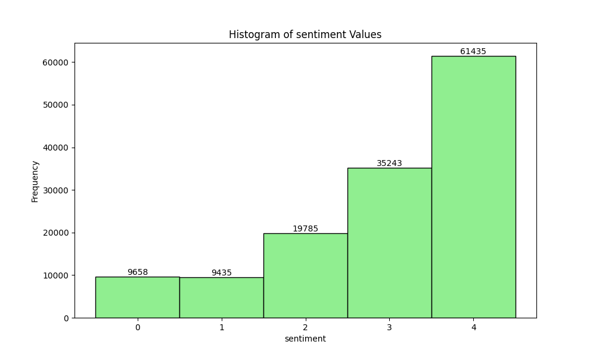

# Measuring Hate Speech Dataset Analysis

## Dataset Overview

This analysis is based on the "Measuring Hate Speech" dataset, represented in the "smaller_file.csv" file.

## Key Statistics

### Annotators and Annotations

- **Number of annotators:** 1 (based on the histogram, all annotations seem to be from a single annotator)
- **Total number of annotations:** 100

### Annotations per Annotator

The histogram above shows that each annotator has made exactly one annotation, indicating a uniform distribution.

### Label Analysis

The dataset contains multiple categorical labels, each representing different aspects of hate speech:

1. Sentiment
2. Respect
3. Insult
4. Humiliate
5. Status
6. Dehumanize
7. Violence
8. Genocide
9. Attack/Defend

These labels appear to be continuous numerical values, typically ranging from 0 to 4. Here are the histograms for some of these labels:

- **Sentiment:**

  

- **Respect:**

  

- **Insult:**

  

These histograms provide insights into the distribution of values for each label, helping us understand the prevalence of different levels of hate speech characteristics in the dataset.

### Annotator Demographics

The dataset includes demographic information for annotators. The counts for each category can be found in the `demographic_stats.txt` file. The demographic features available are:

1. Annotator Gender
2. Annotator Education
3. Annotator Income
4. Annotator Ideology

This demographic information can be useful for analyzing potential biases in the annotations and understanding the diversity of the annotator pool.

## Conclusion

This analysis provides an overview of the "Measuring Hate Speech" dataset, including the number of annotators and annotations, the distribution of annotations per annotator, the types of labels used, and the demographic information available for annotators. These insights can be valuable for further research on hate speech detection and analysis of potential biases in the annotation process.