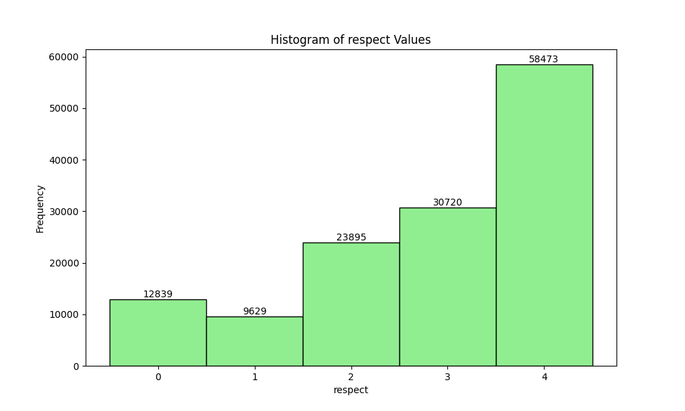
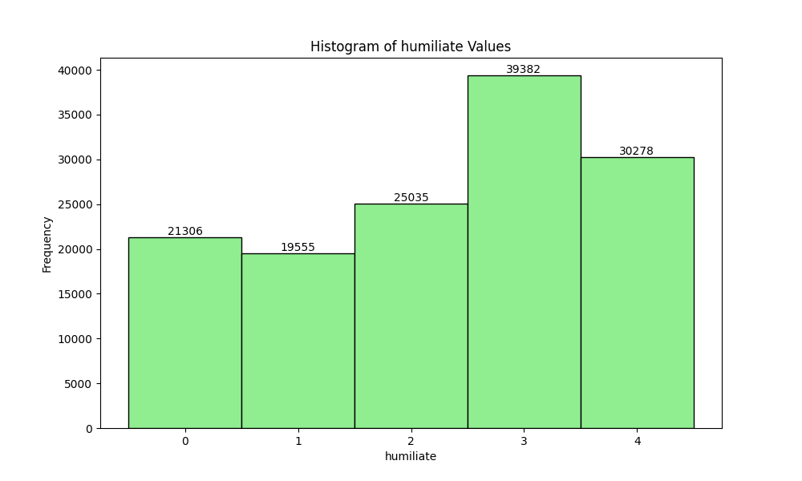

# Measuring Hate Speech Dataset Analysis

## Dataset Overview

This analysis is based on the "Measuring Hate Speech" dataset, represented in the "data/Measuring Hate Speech.csv" file.

## Key Statistics

### Annotators and Annotations

- **Number of annotators:** {num_annotators}
- **Total number of annotations:** {num_annotations}

### Annotations per Annotator

The histogram above shows the distribution of annotations per annotator.

### Label Analysis

The dataset contains multiple labels representing different aspects of hate speech. Here are the distinct labels and their counts:

- **Sentiment:** {distinct_labels['sentiment']}
- **Respect:** {distinct_labels['respect']}
- **Insult:** {distinct_labels['insult']}
- **Humiliate:** {distinct_labels['humiliate']}
- **Status:** {distinct_labels['status']}
- **Dehumanize:** {distinct_labels['dehumanize']}
- **Violence:** {distinct_labels['violence']}
- **Genocide:** {distinct_labels['genocide']}
- **Attack/Defend:** {distinct_labels['attack_defend']}

These labels are continuous numerical values. Here are the histograms for each label:

### Annotator Demographics

The dataset includes demographic information for annotators. The counts for each category can be found in the `demographic_stats.txt` file. The demographic features available are:

1. Annotator Gender
2. Annotator Education
3. Annotator Income
4. Annotator Ideology

This demographic information can be useful for analyzing potential biases in the annotations and understanding the diversity of the annotator pool.

## Conclusion

This analysis provides an overview of the "Measuring Hate Speech" dataset, including the number of annotators and annotations, the distribution of annotations per annotator, the types of labels used, and the demographic information available for annotators. These insights can be valuable for further research on hate speech detection and analysis of potential biases in the annotation process.