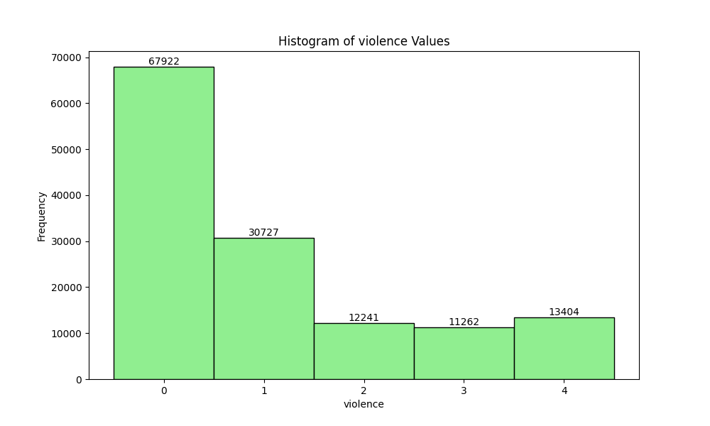
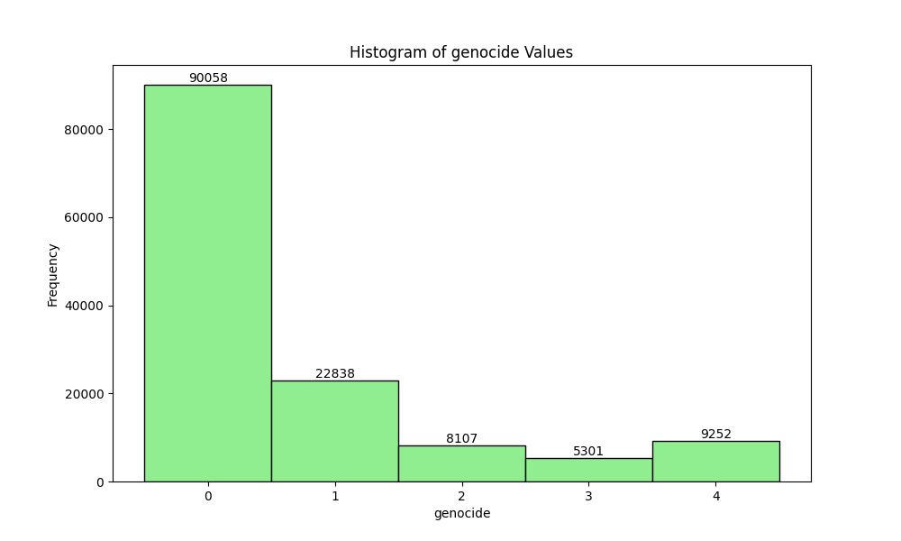
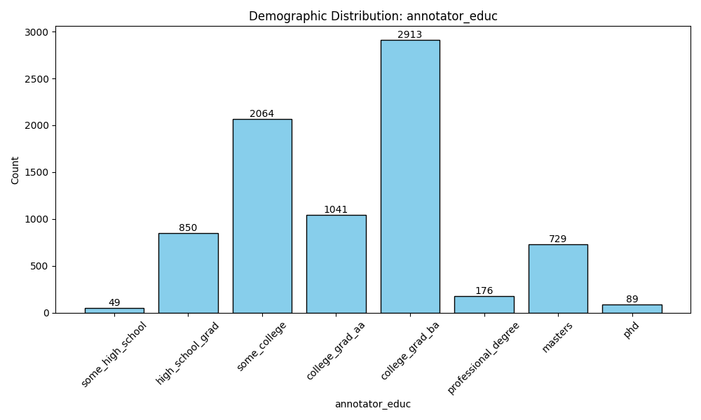
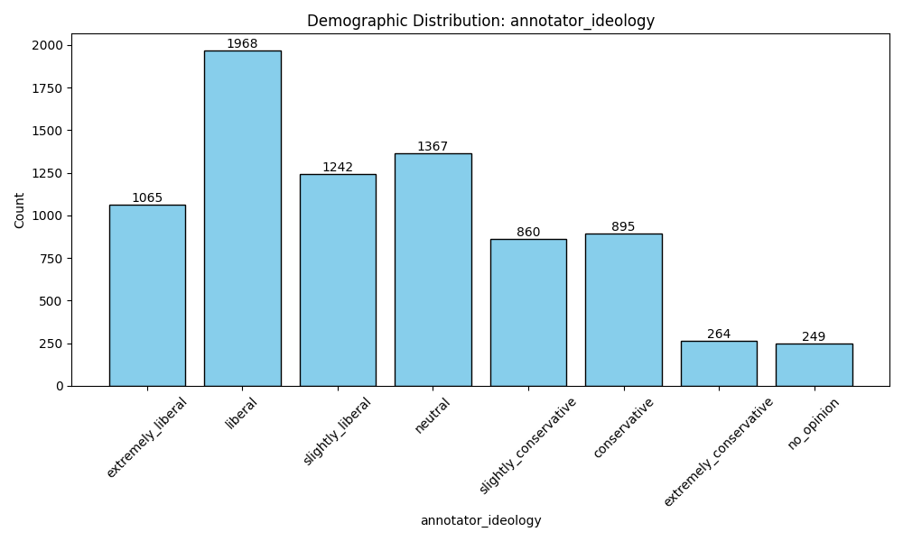

# Measuring Hate Speech Dataset Analysis

## Dataset Overview

This analysis is based on the "Measuring Hate Speech" dataset, represented in the "data/Measuring Hate Speech.csv" file.

## Key Statistics

### Annotators and Annotations

- **Number of annotators:** 7912
- **Total number of annotations:** 135556

### Annotations per Annotator

The histogram above shows the distribution of annotations per annotator.

### Label Analysis

The dataset contains multiple labels representing different aspects of hate speech. Here are the distinct labels and their counts:

- **Sentiment:** 0-4
- **Respect:** 0-4
- **Insult:** 0-4
- **Humiliate:** 0-4
- **Status:** 0-4
- **Dehumanize:** 0-4
- **Violence:** 0-4
- **Genocide:** 0-4
- **Attack/Defend:** 0-4

These labels are continuous numerical values. Here are the histograms for each label:

### Annotator Demographics

The dataset includes demographic information for annotators. Below are the distributions:

#### Annotator Gender

#### Annotator Education

#### Annotator Income

#### Annotator Ideology

Please refer to `analysis_results.txt` for more detailed demographic statistics.

## Data 
The full "Measuring Hate Speech.csv" is not included, as it exceeds the github file size limit.

The .tsv files are created like so: "index" is mapped from "comment_id", "sentence1" is mapped from "text", "sentence2" holds the value "Is this hate speech?" for each row, and "label" is 1 if the variable "hate_speech_score" is greater than 0 and 0 otherwise. 