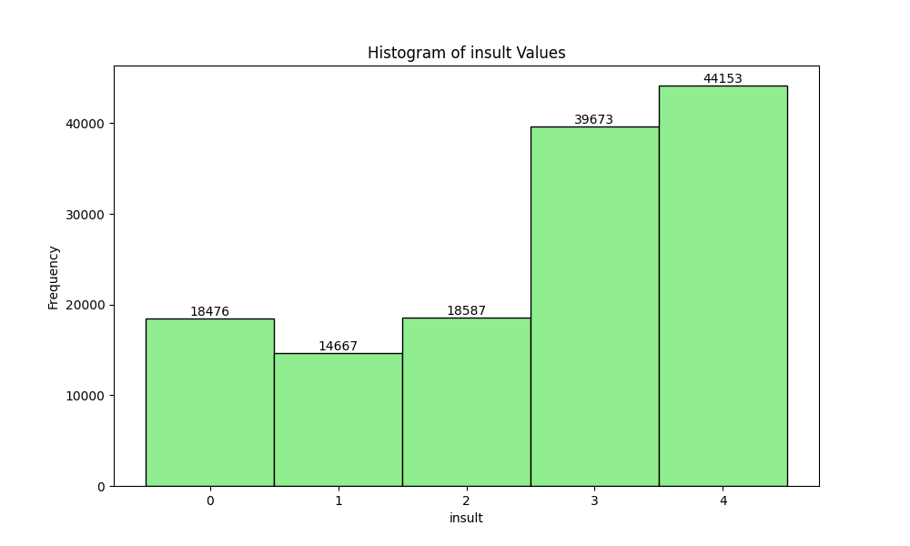
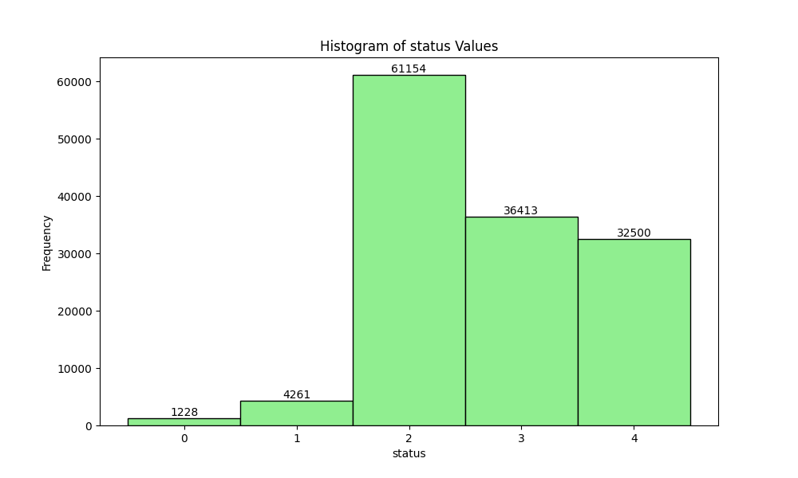

# Hate Speech Dataset Analysis

### Number of Unique Annotators: 7912
### Total Number of Annotations: 135556
### Number of Distinct Labels: 7

### Label Classification Types:
 - sentiment: Categorical
 - respect: Categorical
 - insult: Categorical
 - humiliate: Categorical
 - status: Categorical
 - dehumanize: Categorical
 - violence: Categorical

## Visualizations

## Annotator Demographics (Top 20 per category)

### Annotator severity
| Category | Count |
|:---------|------:|
| -0.21 | 1294 |
| -0.23 | 1210 |
| 0.11 | 1209 |
| 0.05 | 1181 |
| -0.07 | 1163 |
| 0.1 | 1137 |
| -0.08 | 1136 |
| 0.03 | 1117 |
| 0.09 | 1115 |
| 0.01 | 1112 |
| -0.27 | 1112 |
| 0.36 | 1087 |
| 0.07 | 1082 |
| 0.15 | 1069 |
| -0.03 | 1068 |
| -0.02 | 1058 |
| -0.2 | 1039 |
| -0.15 | 1038 |
| -0.12 | 1033 |
| 0.17 | 1024 |

### Annotator infitms
| Category | Count |
|:---------|------:|
| 0.87 | 2453 |
| 0.84 | 2314 |
| 0.88 | 2302 |
| 0.93 | 2258 |
| 0.97 | 2235 |
| 0.82 | 2223 |
| 0.79 | 2209 |
| 0.92 | 2204 |
| 0.89 | 2180 |
| 0.99 | 2179 |
| 0.75 | 2130 |
| 0.8 | 2087 |
| 1.03 | 2051 |
| 0.85 | 2032 |
| 0.98 | 2029 |
| 0.81 | 2014 |
| 0.86 | 2003 |
| 0.96 | 1991 |
| 0.9 | 1990 |
| 0.77 | 1981 |

### Annotator outfitms
| Category | Count |
|:---------|------:|
| 0.64 | 2161 |
| 0.72 | 2144 |
| 0.63 | 2132 |
| 0.69 | 2128 |
| 0.7 | 2116 |
| 0.73 | 2057 |
| 0.79 | 2035 |
| 0.82 | 1996 |
| 0.67 | 1984 |
| 0.74 | 1960 |
| 0.68 | 1959 |
| 0.76 | 1946 |
| 0.78 | 1927 |
| 0.71 | 1905 |
| 0.66 | 1901 |
| 0.85 | 1897 |
| 0.75 | 1852 |
| 0.59 | 1805 |
| 0.87 | 1791 |
| 0.61 | 1782 |

### Annotator gender
| Category | Count |
|:---------|------:|
| female | 76370 |
| male | 57582 |
| non-binary | 985 |
| prefer_not_to_say | 500 |
| self-describe | 119 |

### Annotator trans
| Category | Count |
|:---------|------:|
| no | 133715 |
| yes | 1183 |
| prefer_not_to_say | 658 |

### Annotator educ
| Category | Count |
|:---------|------:|
| college_grad_ba | 50206 |
| some_college | 35115 |
| college_grad_aa | 18011 |
| high_school_grad | 14138 |
| masters | 12593 |
| professional_degree | 3042 |
| phd | 1562 |
| some_high_school | 872 |

### Annotator income
| Category | Count |
|:---------|------:|
| 10k-50k | 56668 |
| 50k-100k | 52803 |
| 100k-200k | 17415 |
| <10k | 6429 |
| >200k | 2138 |

### Annotator gender men
| Category | Count |
|:---------|------:|
| False | 77974 |
| True | 57582 |

### Annotator gender women
| Category | Count |
|:---------|------:|
| True | 76370 |
| False | 59186 |

### Annotator gender non binary
| Category | Count |
|:---------|------:|
| False | 134571 |
| True | 985 |

### Annotator gender prefer not to say
| Category | Count |
|:---------|------:|
| False | 135056 |
| True | 500 |

### Annotator gender self describe
| Category | Count |
|:---------|------:|
| False | 135437 |
| True | 119 |

### Annotator transgender
| Category | Count |
|:---------|------:|
| False | 134373 |
| True | 1183 |

### Annotator cisgender
| Category | Count |
|:---------|------:|
| True | 133715 |
| False | 1841 |

### Annotator transgender prefer not to say
| Category | Count |
|:---------|------:|
| False | 134898 |
| True | 658 |

### Annotator education some high school
| Category | Count |
|:---------|------:|
| False | 134684 |
| True | 872 |

### Annotator education high school grad
| Category | Count |
|:---------|------:|
| False | 121418 |
| True | 14138 |

### Annotator education some college
| Category | Count |
|:---------|------:|
| False | 100441 |
| True | 35115 |

### Annotator education college grad aa
| Category | Count |
|:---------|------:|
| False | 117545 |
| True | 18011 |

### Annotator education college grad ba
| Category | Count |
|:---------|------:|
| False | 85350 |
| True | 50206 |

### Annotator education professional degree
| Category | Count |
|:---------|------:|
| False | 132514 |
| True | 3042 |

### Annotator education masters
| Category | Count |
|:---------|------:|
| False | 122963 |
| True | 12593 |

### Annotator education phd
| Category | Count |
|:---------|------:|
| False | 133994 |
| True | 1562 |

### Annotator income <10k
| Category | Count |
|:---------|------:|
| False | 129127 |
| True | 6429 |

### Annotator income 10k-50k
| Category | Count |
|:---------|------:|
| False | 78888 |
| True | 56668 |

### Annotator income 50k-100k
| Category | Count |
|:---------|------:|
| False | 82753 |
| True | 52803 |

### Annotator income 100k-200k
| Category | Count |
|:---------|------:|
| False | 118141 |
| True | 17415 |

### Annotator income >200k
| Category | Count |
|:---------|------:|
| False | 133418 |
| True | 2138 |

### Annotator race asian
| Category | Count |
|:---------|------:|
| False | 125960 |
| True | 9596 |

### Annotator race black
| Category | Count |
|:---------|------:|
| False | 121950 |
| True | 13606 |

### Annotator race latinx
| Category | Count |
|:---------|------:|
| False | 126055 |
| True | 9501 |

### Annotator race native american
| Category | Count |
|:---------|------:|
| False | 132920 |
| True | 2636 |

### Annotator race pacific islander
| Category | Count |
|:---------|------:|
| False | 135073 |
| True | 483 |

### Annotator race white
| Category | Count |
|:---------|------:|
| True | 109090 |
| False | 26466 |

### Annotator race other
| Category | Count |
|:---------|------:|
| False | 134131 |
| True | 1425 |

### Annotator age
| Category | Count |
|:---------|------:|
| 34.0 | 5977 |
| 29.0 | 5844 |
| 31.0 | 5834 |
| 32.0 | 5591 |
| 35.0 | 5433 |
| 28.0 | 5170 |
| 30.0 | 5146 |
| 37.0 | 4959 |
| 36.0 | 4897 |
| 26.0 | 4698 |
| 33.0 | 4619 |
| 27.0 | 4503 |
| 38.0 | 4117 |
| 25.0 | 4059 |
| 39.0 | 3879 |
| 40.0 | 3629 |
| 24.0 | 3300 |
| 41.0 | 3197 |
| 23.0 | 2799 |
| 42.0 | 2730 |

### Annotator religion atheist
| Category | Count |
|:---------|------:|
| False | 108413 |
| True | 27143 |

### Annotator religion buddhist
| Category | Count |
|:---------|------:|
| False | 133418 |
| True | 2138 |

### Annotator religion christian
| Category | Count |
|:---------|------:|
| False | 76983 |
| True | 58573 |

### Annotator religion hindu
| Category | Count |
|:---------|------:|
| False | 134896 |
| True | 660 |

### Annotator religion jewish
| Category | Count |
|:---------|------:|
| False | 133385 |
| True | 2171 |

### Annotator religion mormon
| Category | Count |
|:---------|------:|
| False | 134490 |
| True | 1066 |

### Annotator religion muslim
| Category | Count |
|:---------|------:|
| False | 134587 |
| True | 969 |

### Annotator religion nothing
| Category | Count |
|:---------|------:|
| False | 98766 |
| True | 36790 |

### Annotator religion other
| Category | Count |
|:---------|------:|
| False | 127045 |
| True | 8511 |

### Annotator sexuality bisexual
| Category | Count |
|:---------|------:|
| False | 123385 |
| True | 12171 |

### Annotator sexuality gay
| Category | Count |
|:---------|------:|
| False | 130223 |
| True | 5333 |

### Annotator sexuality straight
| Category | Count |
|:---------|------:|
| True | 115539 |
| False | 20017 |

### Annotator sexuality other
| Category | Count |
|:---------|------:|
| False | 133473 |
| True | 2083 |

